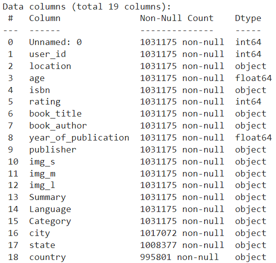
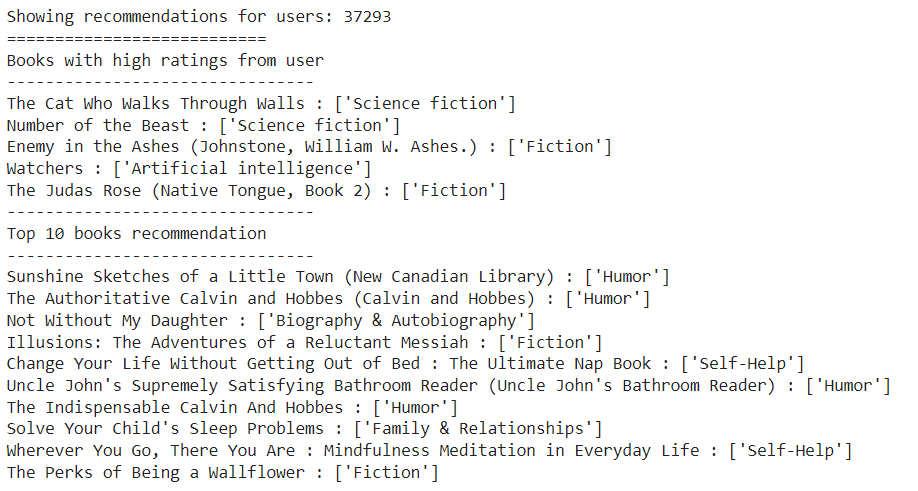

# Laporan Proyek Machine Learning - Panji Arlin Saputra

## Project Overview

Proyek yang dipilih dalam proyek machine learning ini adalah mengenai rekomendasi buku berdasarkan data buku yang telah dibaca oleh warga di negara Kanada dengan judul proyek "Rekomendasi Buku Berdasarkan Data Buku Yang Telah Dibaca Oleh Warga di Negara Kanada".

- Latar Belakang 
    Berdasarkan informasi yang himpun dari [healthline.com](https://www.healthline.com/health/benefits-of-reading-books), membaca merupakan hal yang baik karena dapat meningkatkan fokus, memori, empati, dan keterampilan komunikasi. Ini dapat mengurangi stres, meningkatkan kesehatan mental, dan mengurangi stres. Membaca juga memungkinkan kita mempelajari hal-hal baru agar sukses dalam pekerjaan dan hubungan.

    Mengapa Kanada? terdapat beberapa alasan mengapa saya memilih negara Kanada dalam membuat proyek ini, diantaranya Kanada merupakan salah satu [negara yang paling berpendidikan di dunia](https://www.detik.com/edu/detikpedia/d-5639083/12-negara-paling-berpendidikan-di-dunia-bisa-tebak-nomor-satunya). Selain itu, [penduduk Kanada juga gemar membaca buku](https://www.idntimes.com/life/education/filianti/negara-yang-penduduknya-gemar-membaca-buku-exp-c1c2/9).

**Rubrik/Kriteria Tambahan (Opsional)**:
- Jelaskan mengapa proyek ini penting untuk diselesaikan. 

  Proyek ini penting untuk diselesaikan karena dari sisi penguna, dapat membantu pengguna dalam menemukan buku-buku yang mungkin tidak terpikirkan untuk dicari sebelumnya yang dapat membuat meningkatnya minat baca pengguna sedangkan dari sisi organisasi bisnis, dapat meningkatkan jumlah buku yang terjual. Oleh karena itu, proyek ini bisa menawarkan dan menyeimbangkan layanan bagi kedua pihak.

- Menyertakan hasil riset terkait atau referensi. Referensi yang diberikan harus berasal dari sumber yang kredibel dan author yang jelas. 

  Referensi:
  - [Benefits of Reading Books: How It Can Positively Affect Your Life](https://www.healthline.com/health/benefits-of-reading-books)
  - [12 Negara Paling Berpendidikan di Dunia, Bisa Tebak Nomor Satunya?](https://www.detik.com/edu/detikpedia/d-5639083/12-negara-paling-berpendidikan-di-dunia-bisa-tebak-nomor-satunya)
  - [Ini 12 Negara yang Penduduknya Gemar Membaca Buku di Perpustakaan](https://www.idntimes.com/life/education/filianti/negara-yang-penduduknya-gemar-membaca-buku-exp-c1c2/9)

  

## Business Understanding

### Problem Statements

Berangkat dari latar belakang diatas, berikut ini merupakan rincian masalah yang dapat diselesaikan pada proyek ini :
- Sistem rekomendasi apa yang baik untuk dipakai pada kasus ini?
- Bagaimana cara membuat sistem rekomendasi buku berdasarkan data buku yang telah dibaca oleh warga dinegara Kanada?

### Goals

Berikut adalah tujuan dari dibuatnya proyek ini:
- Membuat sistem rekomendasi buku untuk para pembaca buku khususnya di negara Kanada.
- Memberikan rekomendasi buku yang kemungkinan disukai pengguna.

**Rubrik/Kriteria Tambahan (Opsional)**:

  - ### Solution Approach
    - Sistem rekomendasi yang dibuat dengan menggunakan teknik _Content-Based Filtering_ (filter berbasis konten) dan _Collaborative Filtering_ (filter kolaboratif). Beberapa algoritma yang digunakan untuk membuat sistem rekomendasi di proyek ini diantaranya :
      - _Content-Based Filtering_ (filter berbasis konten)
      
        Filter berbasis konten bekerja dengan merekomendasikan buku yang mirip dengan buku yang telah dibaca oleh pengguna di masa lalu.

        Kelebihan:
          - Model tidak memerlukan data apa pun tentang pengguna lain, karena rekomendasinya khusus untuk pengguna ini. Ini membuatnya lebih mudah untuk menskalakan ke sejumlah besar pengguna.

        Kekurangan :
          - Model hanya dapat membuat rekomendasi berdasarkan minat pengguna yang ada. Dengan kata lain, model memiliki kemampuan terbatas untuk memperluas minat pengguna yang ada.
        
        Algoritma yang digunakan:
          - TF-IDF (_term frequency-inverse document frequency_): 

            TF-IDF adalah pengukuran statistik yang mengevaluasi seberapa relevan sebuah kata dengan dokumen dalam kumpulan dokumen.

            TF-IDF untuk sebuah kata dalam dokumen dihitung dengan mengalikan dua metrik yang berbeda:
            - Frekuensi istilah kata dalam dokumen. Ada beberapa cara untuk menghitung frekuensi ini, dengan cara yang paling sederhana adalah dengan menghitung jumlah kata yang muncul dalam dokumen. Lalu, terdapat cara untuk menyesuaikan frekuensi, berdasarkan panjang dokumen, atau dengan frekuensi kata yang paling sering muncul dalam dokumen.
            - Frekuensi dokumen invers dari kata di satu set dokumen. Maksudnya, seberapa umum atau jarang sebuah kata di seluruh kumpulan dokumen. Semakin dekat ke 0, semakin umum sebuah kata. Metrik ini dapat dihitung dengan mengambil jumlah total dokumen, membaginya dengan jumlah dokumen yang berisi kata, dan menghitung logaritma.
            - Jadi, jika kata tersebut sangat umum dan muncul di banyak dokumen, angka ini akan mendekati 0. Jika tidak, akan mendekati 1.

            Mengalikan dua angka ini menghasilkan skor TF-IDF dari sebuah kata dalam dokumen. Semakin tinggi skornya, semakin relevan kata tersebut dalam dokumen tertentu.

          - _Cosine Similarity_:  
            Cosine similarity mengukur kesamaan antara dua vektor dan menentukan apakah kedua vektor tersebut menunjuk ke arah yang sama. Ia menghitung sudut cosinus antara dua vektor. Semakin kecil sudut cosinus, semakin besar nilai cosine similarity.

            Rumusnya adalah sebagai berikut: 
            
      
      - _Collaborative Filtering_ (filter kolaboratif)

        filter kolaboratif bekerja dengan bergantung pada penilaian komunitas pengguna.

        Kelebihan:
          - Model ini dapat membantu pengguna dalam menemukan minat baru dimana model mungkin masih merekomendasikannya karena pengguna serupa tertarik pada item tersebut.
        
        Kekurangan:
          - Sulit untuk memasukkan fitur sampingan untuk kueri/item. Sebagai contoh, untuk rekomendasi film, fitur sampingan mungkin menyertakan negara atau usia.

## Data Understanding

Informasi Dataset:

| Jenis | Keterangan |
| ----- | ----- |
| Sumber | [Kaggle Dataset - Book-Crossing: User review ratings](https://www.kaggle.com/ruchi798/bookcrossing-dataset) |
| Kategori | Seni dan Hiburan, Komunitas Online, Sastra |
| Jenis dan Ukuran Berkas | CSV (600 MB) |

Pada berkas yang diunduh yakni `Books Data with Category Language and Summary/Preprocessed_data.csv` berisi data rating pengguna terhadap buku yang telah dibaca sebanyak 1.031.175 baris dan 19 kolom. Untuk penjelasan mengenai variabel-variable pada data dapat dilihat pada poin-poin berikut:
1. `Unnamed: 0` : merupakan urutan indeks data yang dimulai dari 0.
2. `user_id` : merupakan data nomor identitas pengguna.
3. `location` : merupakan data alamat pengguna.
4. `age` : merupakan data umur pengguna.
5. `isbn` : merupakan data ISBN (_International Standard Book Number_) atau nomor identitas unik pada buku.
6. `rating` : merupakan data penilaian dari pengguna terhadap buku yang telah dibaca.
7. `book_title` : merupakan data judul buku.
8. `book_author` : merupakan data penulis buku.
9. `year_of_publication` : merupakan data tahun publikasi buku.
10. `publisher` : merupakan data penerbit buku.
11. `img_s` : merupakan data gambar buku dalam ukuran kecil.
12. `img_m` : merupakan data gambar buku dalam ukuran menegah.
13. `img_l` : merupakan data gambar buku dalam ukuran besar.
14. `Summary` : merupakan data ringkasan buku.
15. `Language` : merupakan data bahasa yang digunakan pada buku.
16. `Category` : merupakan data kategori buku.
17. `city` : merupakan data nama kota dari pengguna.
18. `state` : merupakan data nama negara bagian dari pengguna.
19. `country` : merupakan data nama negara dari pengguna.

**Rubrik/Kriteria Tambahan (Opsional)**:
- Beberapa tahapan yang diperlukan untuk memahami data :
  - Memuat informasi pada dataframe 
    

    Dari gambar diatas, terdapat 19 variabel, namun hanya beberapa variabel saja yang diperlukan dalam proyek ini. Oleh karena itu, pada tahap _data preparation_ nanti saya hanya akan menyaring data-data yang diperlukan saja.

  - Menghitung jumlah data yang kosong pada dataframe 
    

    Dari gambar diatas, masih banyak terdapat data kosong. Jadi pada tahap _data preparation_ saya akan menghapus data-data yang memiliki nilai kosong tersebut.

  - Menghitung persentase nilai pada variabel rating 
    

    Dari gambar diatas, lebih dari 60% data memiliki rating bernilai 0, hal ini menyebabkan keanehan pada data karena rating 0 sangat mendominasi dibandingkan nilai yang lain. Oleh karena itu, pada tahap _data preparation_ saya akan melakukan penyariangan data untuk mendapatkan rating pengguna yang hanya berkisar diangka 1 hingga 10 saja.

  - Menampilkan nilai yang ada pada variabel `country` 
    

    Pada dataset, negara Kanada memiliki jumlah pengguna terbanyak ke-2 setelah negara USA. Pada proyek ini, saya hanya akan berfokus pada pengguna yang berasal dari negara Kanada. Oleh karena itu, pada tahap _data preparation_ saya akan menyaring data semua pengguna yang hanya berasal dari negara Kanada saja.

  - Menampilkan nilai yang ada pada variabel `Language` 
    

    Pada varibel `Language` terdapat nilai 9, hal ini menyebabkan keanehan pada data karena nilai 9 tidak mencerminkan sebuah istilah bahasa. Oleh sebab itu, pada tahap _data preparation_ saya akan menghapus semua data yang memiliki nilai yang aneh tersebut.
  
  - Menampilkan nilai yang ada pada variabel `Category` 
    
    Pada varibel `Category`, semua kategori pada buku harusnya diawali dan diakhiri dengan tanda kurung siku, namun pada gambar diatas, terdapat nilai '9' dan tidak diawali/diakhiri dengan tanda kurung siku, hal ini menyebabkan keanehan pada data. Oleh sebab itu, pada tahap _data preparation_ saya akan menghapus semua data yang memiliki nilai yang aneh tersebut.

## Data Preparation
Berikut ini adalah tahapan-tahapan dalam melakukan _data preparation_: 

**Rubrik/Kriteria Tambahan (Opsional)**: (1) Menjelaskan proses data preparation yang dilakukan & (2) menjelaskan alasan mengapa diperlukan tahapan data preparation tersebut :

- Menghapus data yang kosong

  Terdapat masih banyak data yang kosong seperti yang telah divisualisasikan pada tahapan _data understanding_. Jadi, pada tahap ini saya akan langsung menghapus data-data yang memiliki nilai kosong tersebut.

- Menghapus variabel yang tidak diperlukan

  Terdapat variabel yang yang tidak diperlukan dalam proyek ini seperti `Unnamed: 0`, `location`, `img_s`, `img_m`, `img_l`, `Summary`, `city`, `state`. Proses ini bertujuan untuk menghapus variabel yang tidak diperlukan tersebut dengan cara menghapus kolomnya dari dataframe.

- Menyaring data negara pengguna

  Terdapat banyak pengguna yang tersebar di berbagai negara didalam dataset. Pada proyek kali ini saya hanya berfokus pada pengguna yang berasal dari negara Kanada saja. Oleh karena itu, proses penyarigan data negara pengguna dilakukan agar kita mendapatkan data negara pengguna yang sesuai dengan negara tujuan proyek ini yaitu Kanada.

- Menyaring data rating pengguna

  Lebih dari 60% data memiliki rating bernilai 0, hal ini menyebabkan keanehan pada data karena rating 0 sangat mendominasi dibandingkan nilai yang lain. Oleh karena itu, proses penyaringan ini bertujuan untuk mendapatkan rating pengguna yang hanya berkisar diangka 1 hingga 10 saja.

- Mengubah tipe data rating menjadi float

  Berdasarkan infomasi yang didapat dari dataset, kolom `rating` menggunakan tipe data integer. Proses pengubahan tipe data `rating` menjadi float ini bertujuan agar mempermudah proses normalisasi nantinya. Berikut ini adalah visualisasi data `rating` setelah berubah tipe data menjadi float:

  

- Menyaring varibel `Language` 

  Terdapat nilai yang aneh pada varibel `Language` yaitu memiliki nilai '9' yangmana nilai ini tidak mencerminkan kalau itu adalah sebuah istilah _language_. Oleh karena itu, proses ini bertujuan agar dapat menyaring data-data yang memiliki nilai yang valid saja.

- Menyaring variabel `Category`

  Terdapat nilai yang aneh pada varibel `Category` yang berbeda dari nilai yang lain yangmana nilai kategori buku yang benar adalah dituliskan dengan tanda kurung siku. Oleh karena itu, proses ini bertujuan agar dapat menyaring data-data yang memiliki nilai yang valid saja.

- Tidak ada data duplikasi

  Hal ini dilakukan  dengan menggunakan _method_ `duplicate()` pada dataframe kemudian menjumlahkannya dengan _method_ `sum()`. Ini bertujuan agar dapat memastikan bahwa tidak ada data pada review pengguna yang terduplikasi. 

- _Encoding_ variabel `user_id` dan `isbn`

  Setelah melalui berbagai proses pembersihan data, nilai-nilai pada variabel `user_id` memiliki rentang nilai yang sangat beragam dan nilai-nilai pada variabel `isbn` masih bersifat kategoris. Proses ini bertujuan untuk memudahkan pencarian nilai terdekat dari setiap data serta mengubah data yang sebelumnya data ini merupakan data kategoris dan dirubah menjadi data numerik.

  Kemudian saya melakukan proses _mapping_ data hasil encoding variabel `user_id` dan varibel `isbn` kedalam _dataframe_.

- Normalisasi data `rating`

  Selanjutnya saya akan melakukan normalisasi pada variabel `rating`. Proses ini bertujuan untuk mengubah nilai `rating` kedalam kumpulan data dengan skala yang sama, tanpa mengganggu perbedaan dalam rentang nilai.

- Melakukan pembagian data pada dataset

  Proses pembagian data ini akan digunakan untuk modeling menggunakan teknik _collaborative filtering_. Melakukan pembagian dataset menjadi dua bagian dengan rasio 80% untuk data latih dan 20% untuk data validasi. Hal ini dilakukan agar tetap mempertahankan sebagian data yang ada untuk memvalidasi seberapa baik generalisasi model terhadap data baru.

- Membuat dataset buku

  Pada dataset sebelumnya secara khusus untuk menampung semua data review dari pengguna terhadap buku. Pada proses ini bertujuan untuk menampung semua data buku yang dinilai oleh para pengguna dengan tanpa ada duplikasi data buku didalamnya.

## Modeling

Sistem rekomendasi pada proyek ini dibuat dengan menggunakan teknik _Content-Based Filtering_ (berbasis konten) dan _Collaborative Filtering_ (filter kolaboratif yang bergantung pada penilaian komunitas pengguna).

**Rubrik/Kriteria Tambahan (Opsional)**: (1) Menyajikan dua solusi rekomendasi dengan algoritma yang berbeda dan (2) Menjelaskan kelebihan dan kekurangan dari solusi/pendekatan yang dipilih :

- _Content-Based Filtering_ (berbasis konten)

  Teknik ini bekerja dengan merekomendasikan buku yang mirip dengan buku yang telah dibaca oleh pengguna di masa lalu.

  Kelebihan:
    - Model tidak memerlukan data apa pun tentang pengguna lain, karena rekomendasinya khusus untuk pengguna ini. Ini membuatnya lebih mudah untuk menskalakan ke sejumlah besar pengguna.

  Kekurangan :
    - Model hanya dapat membuat rekomendasi berdasarkan minat pengguna yang ada. Dengan kata lain, model memiliki kemampuan terbatas untuk memperluas minat pengguna yang ada.

  Algoritma yang digunakan dalam teknik ini:
    - TF-IDF (_term frequency-inverse document frequency_): 

      TF-IDF adalah pengukuran statistik yang mengevaluasi seberapa relevan sebuah kata dengan dokumen dalam kumpulan dokumen.

      Kelebihannya adalah dapat mengekstrak istilah yang paling deskriptif dalam dokumen sedangkan kekurangannya adalah terkadang kata-kata yang dihasilkan mungkin tidak masuk akal dengan topik dokumen.
      
      Saya melakukan impor modul dari `sklearn.feature_extraction.text.TfidfVectorizer`, setelah itu lakukan perhitungan lalu ditransformasikan ke bentuk matriks. Kemudian perhitungan dilanjutkan dengan algoritma _cosine similarity_.
    
    - _Cosine Similarity_:  
      
      _Cosine similarity_ mengukur kesamaan antara dua vektor dan menentukan apakah kedua vektor tersebut menunjuk ke arah yang sama. Ia menghitung sudut cosinus antara dua vektor. Semakin kecil sudut cosinus, semakin besar nilai cosine similarity.

      Kelebihannya adalah baik untuk mengukur kesamaan antara dua vektor bahkan jika ada duplikasi data sedangkan kekurangannya adalah besarnya vektor tidak diperhitungkan, hanya arahnya ini berarti perbedaan nilai tidak sepenuhnya diperhitungkan.

      Saya melakukan impor modul dari `sklearn.metrics.pairwise.cosine_similarity`, setelah itu lakukan perhitungan dengan _cosine similarity_.
  
  Berikut ini adalah contoh _Top-N_ rekomendasi buku dari salah satu sampel buku yaitu buku _Flower Painting in Watercolor_:

  

- _Collaborative Filtering_ (filter kolaboratif)

  Teknik ini bekerja dengan bergantung pada penilaian komunitas pengguna.

  Kelebihan:
    - Model ini dapat membantu pengguna dalam menemukan minat baru dimana model mungkin masih merekomendasikannya karena pengguna serupa tertarik pada item tersebut.
  
  Kekurangan:
    - Sulit untuk memasukkan fitur sampingan untuk kueri/item. Sebagai contoh, untuk rekomendasi film, fitur sampingan mungkin menyertakan negara atau usia.
  
  Proyek ini menerapkan teknik _collaborative filtering_ untuk membuat sistem rekomendasi. Teknik ini membutuhkan data rating dari user.

  Proyek ini membuat class RecommenderNet dengan [keras model class](https://keras.io/api/models/model/). Kode class RecommenderNet ini terinspirasi dari tutorial dalam situs [Keras](https://keras.io/examples/structured_data/collaborative_filtering_movielens/) dengan beberapa penyesuaian terhadap kasus yang sedang diselesaikan.

  Berikut ini adalah _Top-10_ rekomendasi buku untuk salah seorang sampel pengguna:

  

## Evaluasi
- _Content-Based Filtering_ (berbasis konten)

  Sistem rekomendasi yang dibuat dengan teknik _content-based filtering_ menggunakan metrik presisi. Berikut ini adalah hasil pengukuran dengan metrik presisi pada sistem rekomendasi telah dibuat sebelumnya:

  

  Dari hasil diatas, pada salah satu sampel buku, saya memperoleh 91 buku yang relevan dari 100 buku yang direkomendasikan dengan hasil presisi sebesar 91%. Nilai tersebut cukup bagus untuk sistem rekomendasi.

- _Collaborative Filtering_ (filter kolaboratif)

  Pada proyek ini, model yang dibuat dengan teknik _collaborative filtering_ menggunakan metrik evaluasi MSE (mean squared error). Berikut ini adalah hasil pengukuran model metrik evaluasi pada model yang telah dibuat sebelumnya:

  

  Dapat dilihat pada visualisasi diatas, proses training model cukup _smooth_. Dari proses ini, saya memperoleh nilai akhir MSE sebesar sekitar 0.0045 dan MSE pada data validasi sebesar 0.0478 . Nilai tersebut cukup bagus untuk sistem rekomendasi.

**Rubrik/Kriteria Tambahan (Opsional)**: 
- Menjelaskan formula metrik dan bagaimana metrik tersebut bekerja.

  Berikut ini adalah penjelasan mengenai metrik evaluasi yang digunakan pada proyek ini:
  - Metrik Presisi

    - Dalam konteks ini, metrik presisi adalah metrik yang mengkuantifikasi jumlah rekomendasi yang dibuat. Ini dihitung sebagai rasio total rekomendasi yang relevan dibagi dengan jumlah total rekomendasi yang diberikan. Berikut ini adalah rumusnya:

    

  - MSE (*mean squared error*)
  
    - Dalam menghitung MSE, perlu mencari nilai beda antara nilai prediksi model dan nilai sebenarnya lalu dikuadratkan dan dijumlahkan total seluruhnya kemudian dibagi dengan banyak sampel pada dataset. Berikut ini adalah rumusnya:

    

    Dimana N adalah jumlah sampel yang diuji.

    - MSE memiliki kelebihan yaitu sederhana dalam perhitungan sedangkan kelemahannya adalah akurasi hasil prediksi sangat kecil karena tidak memperhatikan apakah hasil prediksi lebih besar atau lebih kecil dibandingkan kenyataannya.

    - Untuk menerapkan MSE kedalam kode, kita perlu mengimpor pustaka berikut ini : `tensorflow.keras.metrics.MeanSquaredError`.

**---Ini adalah bagian akhir laporan---**